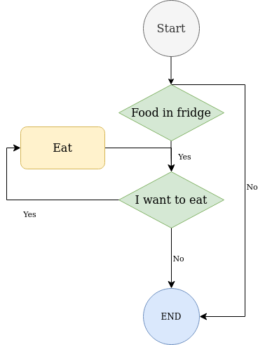
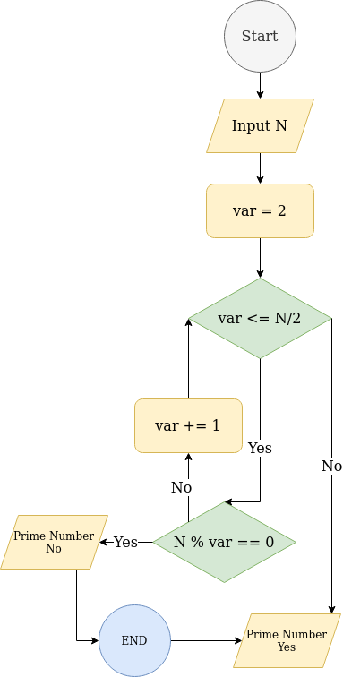

# HomeWorkGo

## Description:
```Text
a) Алгоритм перевірки машини перед покупкою: якщо кузов поганий - не купуємо машину, після перевіряємо двигун, якщо двигун поганий - не купуємо машину, якщо і кузов і двигун норм - купуємо машину.
b) Якщо холодильник не пустий - їсти, не зупиняючись, поки не наїлись.
c) На вхід подається натуральне число N, вивести перших 10 чисел, що націло діляться на N.
d) * На вхід подається натуральне число, вивести “Так“, якщо число є простим (просте число - це таке натуральне число N, яке можна націло розділити тільки на 1 і на N, наприклад: 1, 2, 3, 7, 17, 457), або “Ні” якщо не є.
````

## a:


## b:


## c:


## d:

